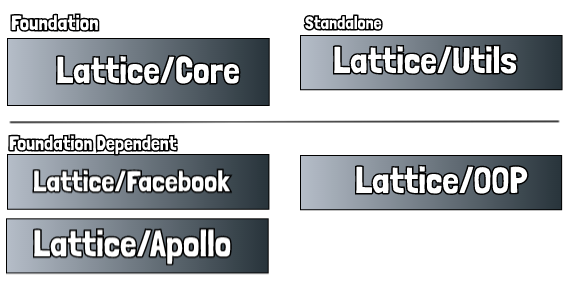

# GraphQL Lattice/Core

## Introduction

Welcome to GraphQL Lattice. Lattice is a library that helps ease the pain of organizing and writing your GraphQL implementations, schema and resolvers. Subsequently, since there is a lightweight format for how to write your implementations in GraphQL Lattice and because Lattice has plugins for both the Facebook Reference Implementation and Apollo Server engine, it also provides an easy ability to switch back and forth between the platforms. It also provides and interface to allow future engine plugins to be easily built.

This major refactor of GraphQL Lattice sees a move to splitting the functionality of Lattice into separate modules so that users can pick and choose the functionality that they wish to use and have. Lattice is being broken into a few different layers and adjacent sections, some of which depend on core and some that do not. Prior versions of lattice assumed an object oriented design pattern.

There are several reasons for this, but most of them are based on peer review and feedback. Some folks wanted to be able to use the decorator heavy ES6/7 style JavaScript classes, while others wanted plain old bare
bones JavaScript objects.

## Tell me about the modules

So glad you asked :)

There are five modules separate modules in this release.

  * Core
    * ConfigParser
    * EnginePlugin
    * factory
    * language
  * Utils
    * SyntaxTree
    * SchemaParser
      * SchemaModule
      * SchemaPlugin
  * Facebook
    *Facebook Reference implementation*
  * Apollo
    *Apollo Server implementation*
  * OOP
    *Object Oriented Programming module*
